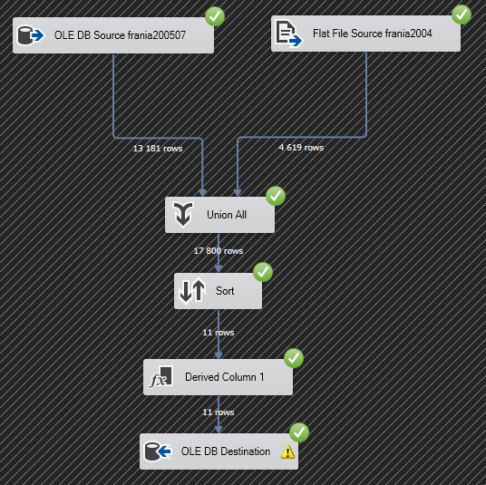
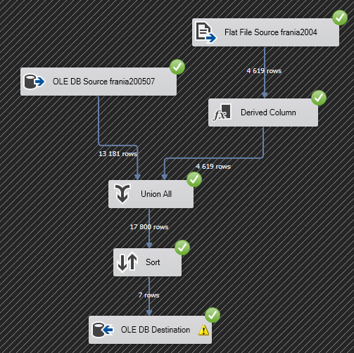
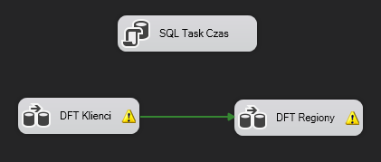
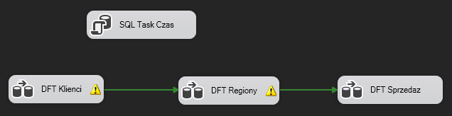
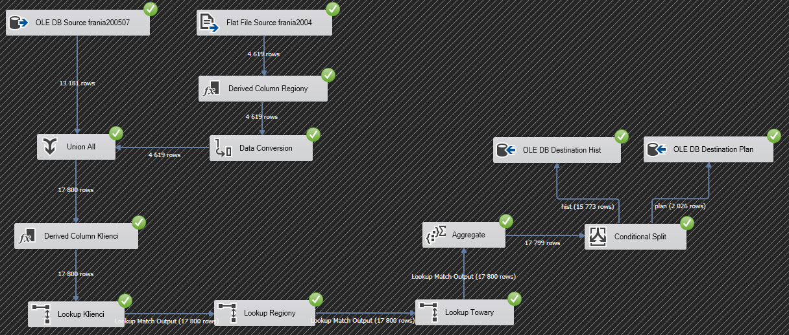

# Frania data warehouse

### Tools used: T-SQL, SSIS
  
### Table of contents
* [Create an ETL package with SSIS](#create-an-etl-package-with-ssis)

## Prepare data  
* import [frania200507.txt](./frania200507.txt) and execute [frania200507-init.sql](./frania200507-init.sql)  
* create warehouse schema – run [createFrania.sql](./createFrania.sql)  

## Create an ETL package with SSIS   
* add 2 DFTs and connect them 

  

### Populate Klienci dimension  

* add 2 data sources, the first one being *frania200507* table created earlier and the second one being [frania2004.txt](./frania2004.txt). Use only *"klient"* column  
* join them using Union All component
* sort and remove duplicates
* change empty values to "Inny" using Derived Column component
* add destination – Klienci dimension table

  

### Populate Regiony dimension  

* add 2 data sources, Use only *"region"* column 
* modify data coming from the file, set "Others" to "Pozostale" to match data in the table
* join data using Union All component
* sort and remove duplicates
* add destination – Regiony dimension table

 

### Populate Czas dimension  

* add [sPopulateCzas.sql](./sPopulateCzas.sql)  to control flow  

  

### Populate fact tables  

* add another DFT to control flow and connect previous DFT to it  

  

* add 2 data sources, Use every column except *"ID"*
* modify data coming from the file, set "Others" to "Pozostale" to match data in the table
* change data types using Data Conversion component. Set *ilosc* to four-byte singed integer, *cena_hurt* and *obrot* to currency
* join data using Union All component
* change empty values in *klient* column to "Inny" 
* add Lookup component, map *klient – Klient*, select column *ID* and create *IdKlient* column based on it.  
* repeat Lookups for *Regiony* and *Towary*. For *Towary* map using 3 columns – *sprzet-towar*, *grupa-grupa*, *podgrupa-podgrupa*  
* add Aggregate component, select foreign keys (*IdKlient, IdRegion, IdTowar, data*), facts (*ilosc, cena_hurt, obrot*) and *hist_plan* column. Group by foreign keys and *hist_plan*. Aggregate facts: *ilosc*, *obrot* – SUM, *cena_hurt* – AVG
* split the data to 2 fact tables using Conditional Split component. Rows with value 'hist' goes to *"Sprzedaz_hist"* table, and those with 'plan' flows to "Sprzedaz_plan"* table  

  